# 如何手动安装扩展

本文档旨在帮助不知道如何手动安装浏览器扩展的用户，以顺利安装本扩展。

## 支持的浏览器

本扩展支持以下 PC 端浏览器（在 win11 下测试）：

- Microsoft Edge 最新版
- Google Chrome 最新版
- QQ 浏览器 最新版
- 360安全、360极速浏览器 最新版

支持以下 Mac 端浏览器（在 MacOS 12 下测试）：

- Microsoft Edge 最新版
- Google Chrome 最新版

注意：MacOS 上的 Safari 浏览器无法手动安装浏览器扩展，本扩展 **暂不支持 Safari 浏览器**。

## 浏览器下载

浏览器作为上网的基础工具，其下载和使用不在这里介绍，建议到各个浏览器的官方网站下载使用。

## 扩展的安装

首先，将获得的本扩展的压缩包，解压到任意你觉得合适的位置。

### Edge 浏览器

打开 Edge 浏览器，点击右上角的“三个点”（**标注1**），在弹出的菜单中选择 “扩展”（**标注2**）菜单项：
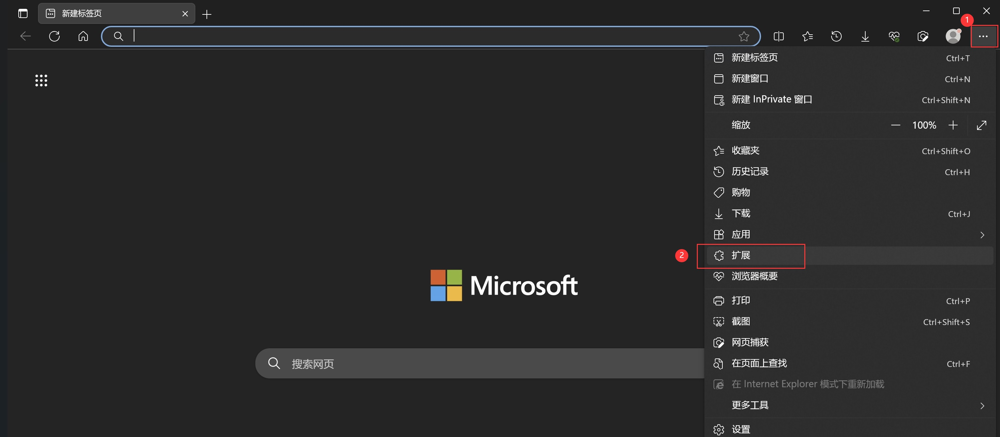

此时，工具栏会出现“扩展”图标（**标注1**），并选择弹窗里的“管理扩展”（**标注2**）：
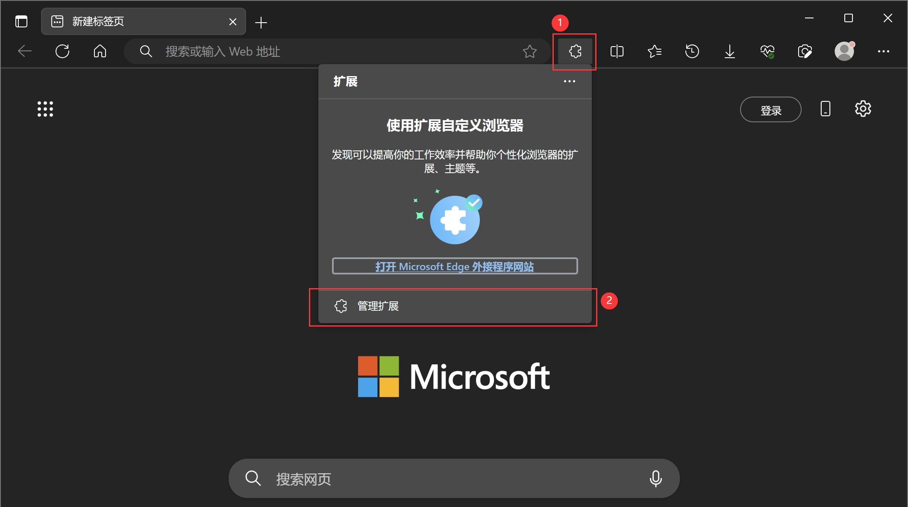

在扩展管理窗口，先将左侧“开发人员模式”选项开启（**标注1**），再点击右侧的“加载解压缩的扩展”（**标注2**），在弹出的窗口中，选择之前解压出来的扩展所在的文件夹（**标注3**），再点击“选择文件夹”（**标注4**）：
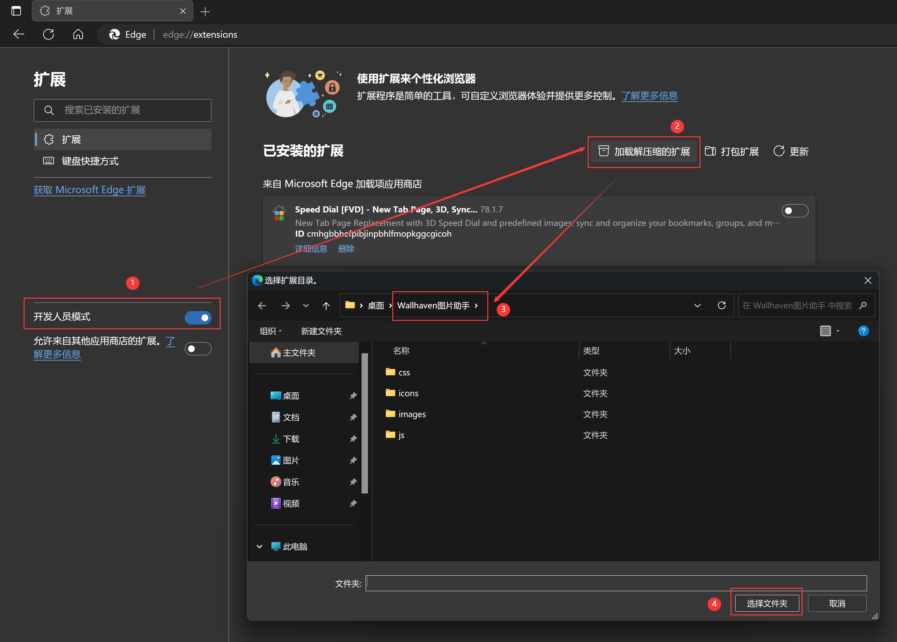

此时，在“已安装的扩展-来自其他源”列表中会出现本扩展，并且已自动启用（**标注1**），点击工具栏中的“扩展”图标（**标注2**），在弹出的列表中点击本扩展右侧的“眼睛”图标（**标注3**），可将本扩展固定在工具栏上：
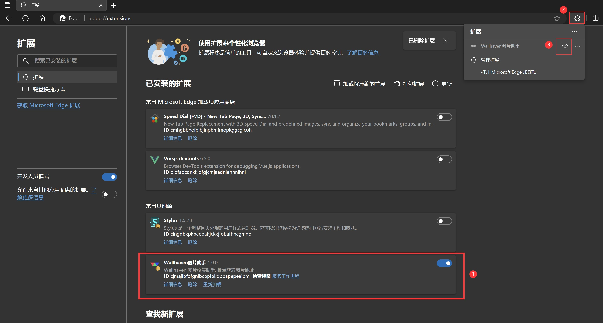

至此，本扩展就安装完成了。

### Chrome 浏览器

打开 Chrome 浏览器，点击右上角的“三个点”（**标注1**）弹出菜单，选择 “扩展程序”（**标注2**） - “管理扩展程序”（**标注3**） 菜单项：
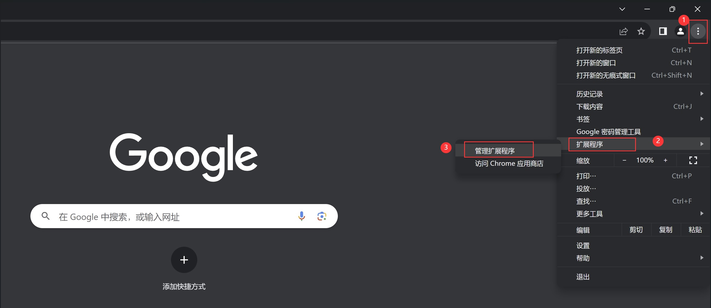

在打开的扩展程序管理窗口中，先开启“开发者模式”（**标注1**），然后点击“加载已解压的扩展程序”（**标注2**），在弹出的窗口中，选择之前解压出来的扩展所在的文件夹（**标注3**），再点击“选择文件夹”（**标注4**）：
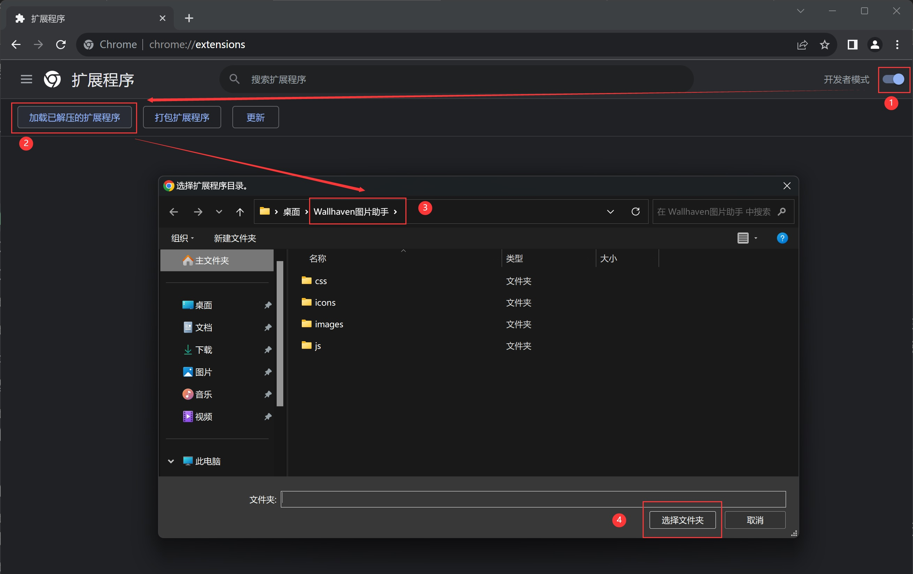

此时，扩展就出现在了扩展程序列表中（**标注1**），接下来点击浏览器工具栏上的“扩展程序”图标（**标注2**），在弹出的列表中点击扩展右侧的“图钉”图标（**标注3**）可以将工具固定在工具栏上：
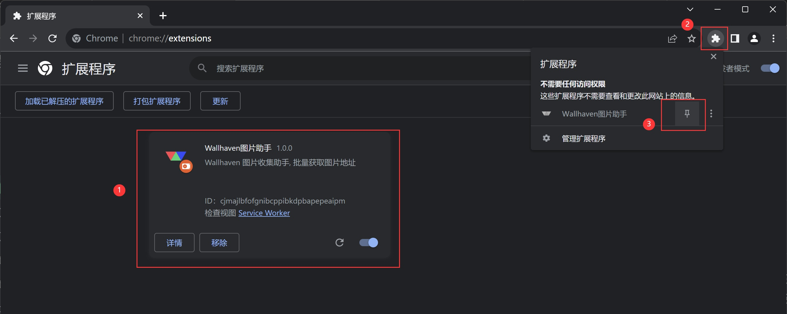

至此，扩展就安装完成了。

### QQ 浏览器

打开 QQ 浏览器，点击右上角的“三横线”（**标注1**），在弹出的菜单中选择 “应用中心”（**标注2**）：
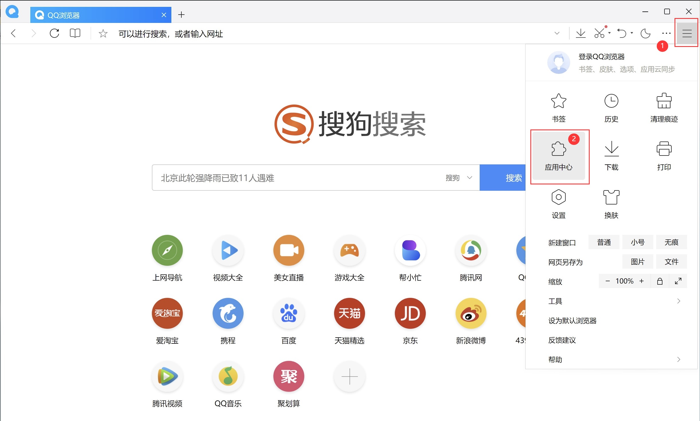

在“管理我的应用”窗口，先开启“开发者模式”（**标注1**），再点击“加载已解压的扩展程序”（**标注2**），在弹出的窗口中，选择之前解压出来的扩展所在的文件夹（**标注3**），再点击“选择文件夹”（**标注4**）：
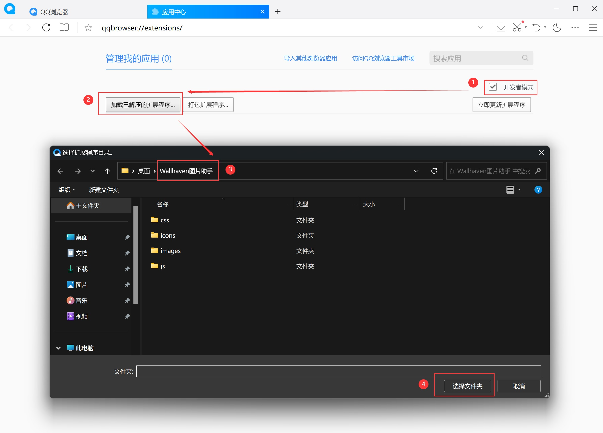

此时，扩展已出现在应用列表中（**标注1**），同时在浏览器工具栏也出现了扩展的图标（**标注2**）：
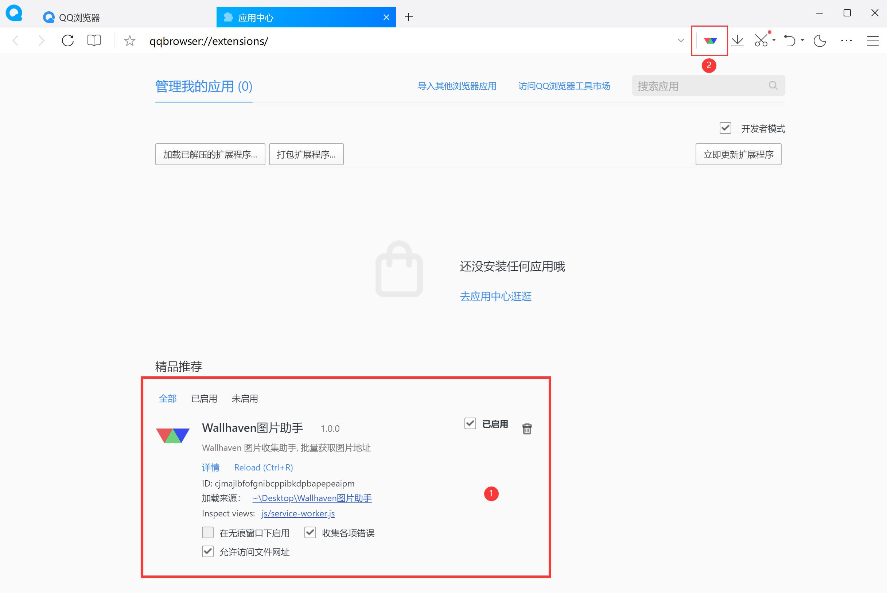

至此，扩展就安装完成了。

### 360 安全浏览器

打开 360 安全浏览器，点击工具栏上的“田字”插件按钮（**标注1**）弹出操作窗口，然后点击 “管理”（**标注2**）：
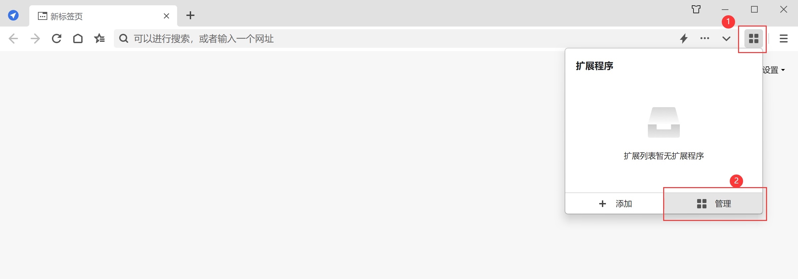

在打开的“扩展管理”窗口，点击“高级管理”：
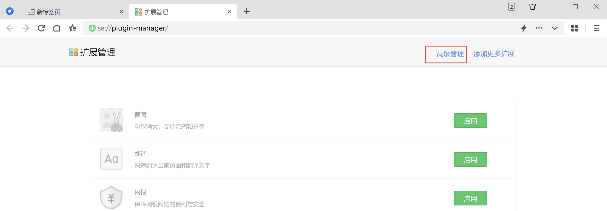

在打开的“扩展程序”窗口，先开启“开发者模式”（**标注1**），再点击“加载已解压的扩展程序”（**标注2**），在弹出的窗口中，选择之前解压出来的扩展所在的文件夹（**标注3**），再点击“选择文件夹”（**标注4**）：
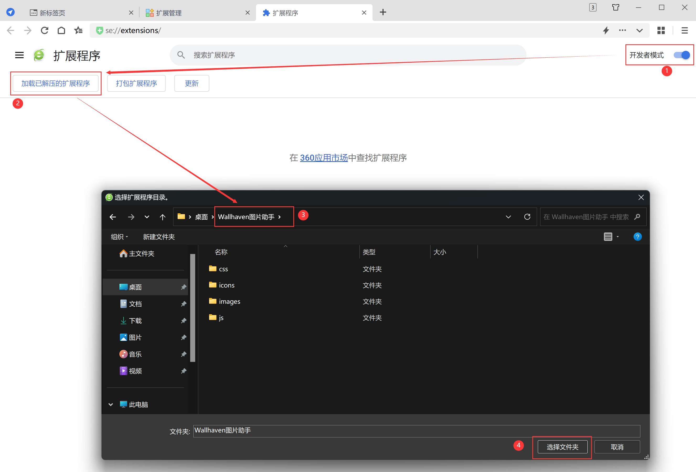

此时，扩展已出现在扩展程序列表中（**标注1**），同时在浏览器工具栏也出现了扩展的图标（**标注2**）：
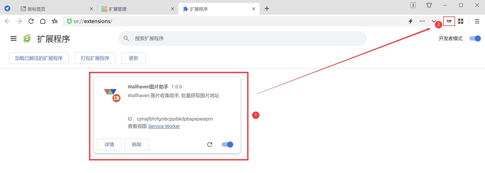

至此，扩展就安装完成了。

### 360 极速浏览器

打开 360 极速浏览器，点击工具栏上的“田字”插件按钮（**标注1**）弹出操作窗口，然后点击 “更多扩展”（**标注2**）：
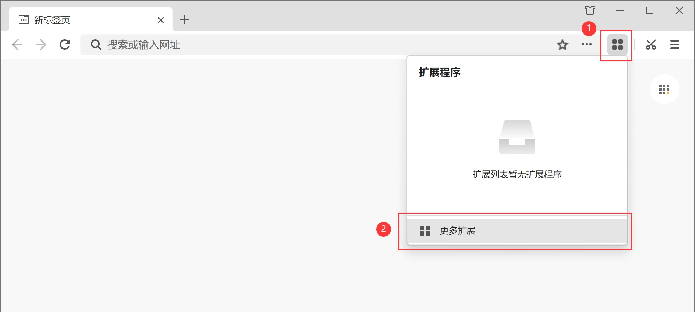

在打开的“扩展中心”窗口，点击左侧“管理已安装的扩展”（**标注1**）：
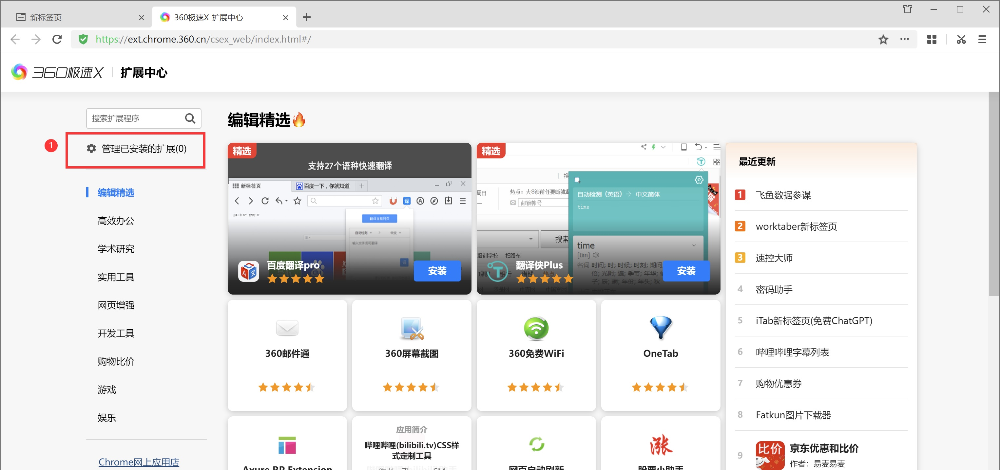

在打开的“已安装扩展”窗口，先开启“开发者模式”（**标注1**），然后选择“加载已解压的扩展程序”（**标注2**），在弹出的窗口中，选择之前解压出来的扩展所在的文件夹（**标注3**），再点击“选择文件夹”（**标注4**）：
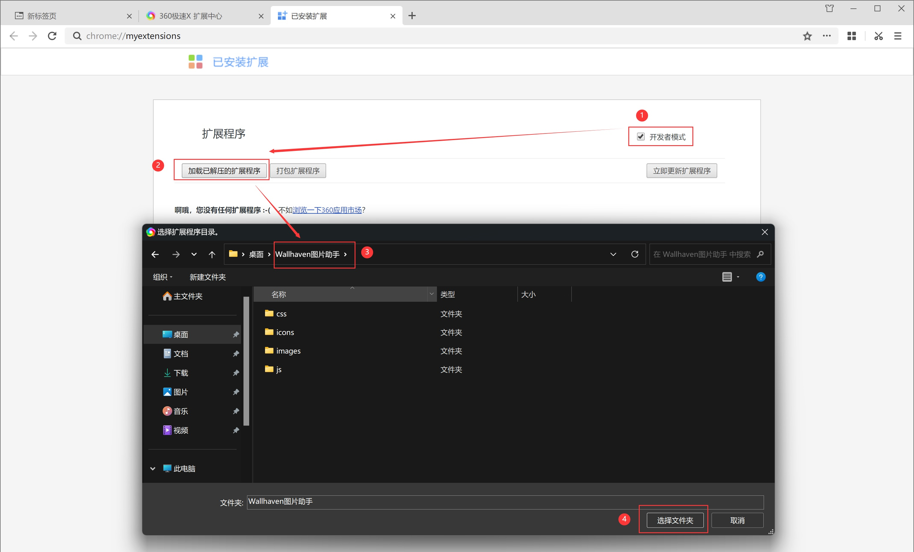

此时，扩展已出现在扩展程序列表中（**标注1**），点击工具栏“田字”插件按钮（**标注2**），在弹出的操作窗口中，点击工具右侧的“图钉”图标（**标注3**），可以将扩展固定在工具栏上（**标注4**）：
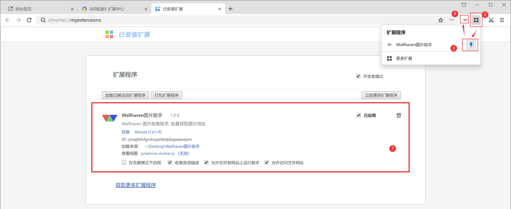

至此，扩展就安装完成了。

如果在安装过程中出现任何问题，可以到 [issues](https://github.com/zoujia/WallhavenAssistant/issues) 里进行反馈，尽量详细说明问题复现的过程。
