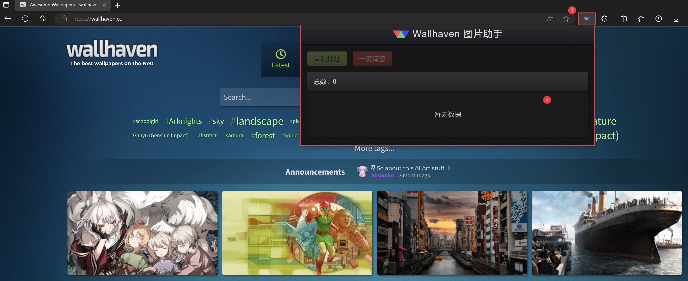
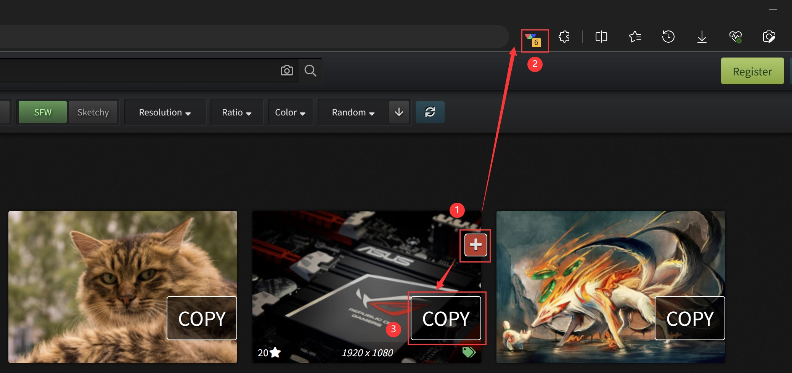
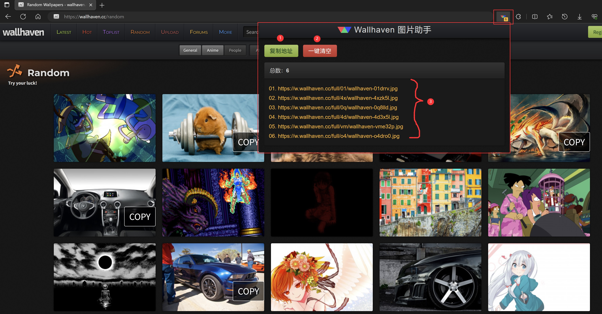

# 如何使用扩展

本文档仅以 Edge 浏览器为例，使用图文的方式介绍本扩展的使用方法。

## 使用

在扩展完成安装之后，打开 [wallhaven 网站](https://wallhaven.cc/)，此时本扩展对应的图标处于激活可用的状态（**标注1**），点击图标之后显示的是本扩展的窗口界面（**标注2**）：

打开受支持的页面，比如 [最新 Latest](https://wallhaven.cc/latest)，鼠标滑过图片缩略图，会显示一个“加号”图标按钮（**标注1**），点击此图标，工具栏里的本扩展图标上会以 **角标** 的形式显示当前被添加的图片数量（**标注2**），同时该缩略图右下角会显示“COPY”字样（**标注3**）代表该图片的地址已被复制，如下图所示：

点击工具栏里的扩展图标会显示扩展的界面，功能包括（见下图）：

- 复制地址（**标注1**）：点击按钮复制当前所有被添加的图片的地址到剪贴板
- 一键清空（**标注2**）：点击按钮则清除所有被添加的图片地址
- 图片地址列表（**标注3**）：列出当前所有被添加的图片完整 URL 地址

## 说明

- 本扩展复制的图片地址，不是图片列表里的 **缩略图** 的地址，而是该图片的高清图地址，即点击缩略图打开的图片详情页面里展示的高清图片
- **COPY** 字样：此标记只用于标记 **当前操作** 产生了预期效果，如果重新刷新页面，即使此图片地址已经存在于列表里，也不再出现此字样；同样的，如果清除了列表数据，此标记也还是存在，直到下次刷新页面才会消失
- 同一张图片多次点击“加号”按钮，只会被 **添加一次**
- 被添加的图片地址会一直保存，即使关闭浏览器或电脑，下次打开依然存在，只有手动清空或卸载本扩展才会清除数据

复制图片地址之后，就可以选择自己喜欢的下载软件，进行批量下载。在下载的过程中，可能会出现长时间不响应的情况，主要是因为网络问题，可以等一段时间再试。另外，该网站在某些时候可能无法正常使用，需要自己解决科学上网的问题。

## 常见问题

Q: 在卸载、重新安装、重新启用或重新加载之后，点击 **“添加按钮”**  没有反应，在扩展管理界面此扩展详情页会出现类似 **“Extension context invalidated”** 的错误？

A: 重新刷新一下已打开的目标页面。

如果在使用过程中出现任何问题，可以到 [issues](https://github.com/zoujia/WallhavenAssistant/issues) 里进行反馈，尽量详细说明问题复现的过程。
